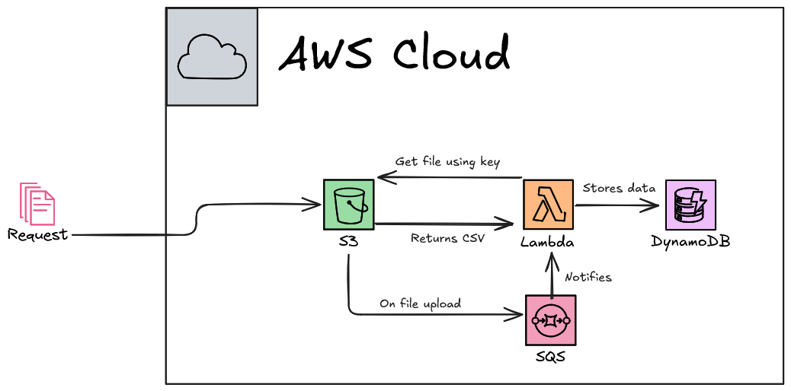

# Lambda CSV Parser

This project is a Lambda function designed to parse CSV files containing member data. It reads the CSV file, validates the headers, and processes each member's information, then, it stores the data in a DynamoDB table.

## Features
- Reads CSV files from input.
- Validates the headers against expected values.
- Processes each member's information.
- Stores the data in a DynamoDB table.

## Schema

## To-Do

- [X] Implement DynamoDB integration.
- [ ] Implement lambda function to trigger on CSV upload.
- [ ] Implement dynamoDB table checks and error handling.
- [ ] Add logging for better traceability.
- [ ] Implement unit tests for CSV parsing and data storage functions.
- [ ] Implement DynamoDB item existence check before insertion.
